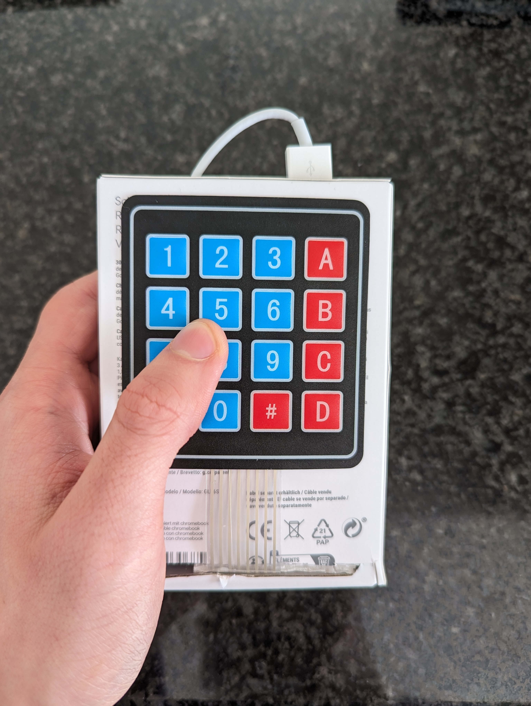

# ESP32-Bluetooth-Mouse-Remote-Control

## Description

This repository hosts a project that utilizes an ESP32 microcontroller connected to a gyroscope and a 4x4 keypad to function as a Bluetooth mouse remote control. The project aims to offer a convenient and intuitive way to control mouse functions wirelessly using motion gestures and keypad inputs.

## Key Features

**Bluetooth Mouse Control:** The ESP32, integrated with the gyroscope and keypad, allows users to control mouse movements, clicks, and other functions via Bluetooth connectivity.
**Gyroscope Integration:** The gyroscope sensor enables gesture-based control, allowing users to move the cursor by tilting the device in different directions.
**Keypad Input:** The 4x4 keypad provides additional input functionalities, such as scrolling and button shortcuts, enhancing the user experience and versatility of the Bluetooth mouse remote control.

## Components

**ESP32 Microcontroller:** Acts as the central processing unit, coordinating communication between the gyroscope, keypad, and Bluetooth module.
**Gyroscope Sensor:** Detects motion and orientation changes, translating them into mouse movements for cursor control.
**4x4 Matrix Array Keypad:** Provides tactile input for various mouse functions and shortcuts.

## Code

[Click here for code!](Mouse_remote_control.ino)

## Useful links

[How to Use ESP32 with Gyroscope as a Bluetooth Mouse](https://diy-project.tistory.com/147)
